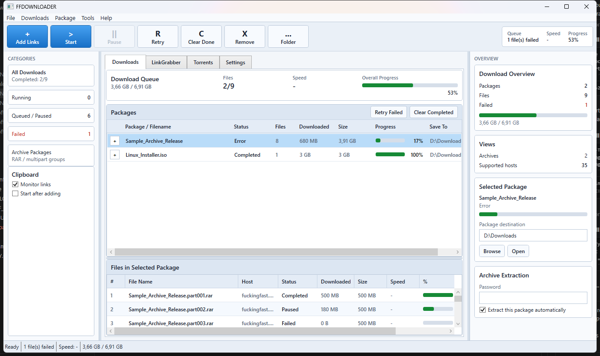
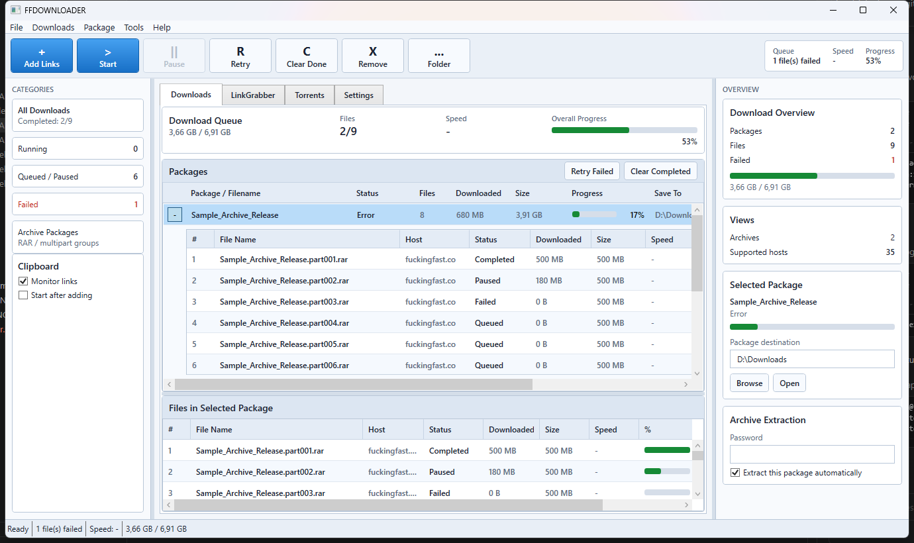

# FFDOWNLOADER

FFDOWNLOADER is a portable Windows download manager built with .NET 8 and WPF. It monitors the clipboard, captures supported file-host links, groups multipart archives automatically, resolves final download URLs, and downloads files with resumable multi-connection transfers.

> Use FFDOWNLOADER only for files you are authorized to download. Host support is implemented as plugins/adapters and may need maintenance when a website changes its markup or protection flow.

## Highlights

- Portable single-file Windows executable.
- Clipboard monitor with confirmation before adding links.
- Bulk paste dialog that extracts links from messy text.
- Automatic grouping of multipart archives such as `.part001.rar`, `.part002.rar`, etc.
- Automatic FuckingFast, Datanodes, MediaFire, MultiUp, and ~30 generic mirror host resolvers with fast HTTP parsing and hidden/interactive WebView2 fallback (with a JDownloader-style captcha-solving prompt).
- Resumable downloads using HTTP `Range`.
- Multi-connection segmented downloads per file.
- Adaptive connection rules by host.
- Temporary `.ffdownload` files and atomic commit when complete.
- Queue persistence in `data/queue.json`.
- Automatic retry and expired `/dl/` URL renewal.
- Speed limit, concurrent downloads, connection count, extraction and password settings.
- Automatic extraction for supported archives through SharpCompress.
- Classic download-manager UI inspired by JDownloader and IDM.
- Expandable package rows with per-file status, progress, speed and errors inline.
- Built-in torrent client (magnet links and `.torrent` files) with DHT, PEX, LSD, port forwarding, and optional seed ratio/time limits.

## Screenshots





## Download

The recommended build is published as a GitHub Release:

- `FFDOWNLOADER-win-x64.zip`

After extracting, run:

```powershell
FFDOWNLOADER.exe
```

The application stores portable runtime state next to the executable under `data/`.

## Build From Source

Requirements:

- Windows 10 or newer
- .NET 8 SDK
- Microsoft Edge WebView2 Runtime

Build and test:

```powershell
dotnet test FFDownloader.sln
dotnet build src\FFDownloader.App\FFDownloader.App.csproj -c Release
```

Publish the portable executable:

```powershell
.\scripts\package-release.ps1 -Version 1.1.0
```

The release ZIP is written to `artifacts\release\`.

## Repository Layout

```text
src/
  FFDownloader.Core/     Download engine, queue, parsers, host resolvers
  FFDownloader.App/      WPF application
tests/
  FFDownloader.Core.Tests/
  FFDownloader.App.Tests/
docs/
  assets/screenshots/
  ARCHITECTURE.md
  DOWNLOAD_ENGINE.md
  HOST_RESOLVERS.md
  RELEASING.md
scripts/
  package-release.ps1
  publish-release.ps1
```

## Documentation

- [Architecture](docs/ARCHITECTURE.md)
- [Download engine](docs/DOWNLOAD_ENGINE.md)
- [Host resolvers](docs/HOST_RESOLVERS.md)
- [Usage](docs/USAGE.md)
- [Releasing](docs/RELEASING.md)
- [Roadmap](docs/ROADMAP.md)

## Current Host Support

FFDOWNLOADER recognizes and downloads from **35 hosts** in total.

### Dedicated resolvers (fully automatic)

| Host | Notes |
| --- | --- |
| `fuckingfast.co` | HTTP parser plus hidden WebView2 fallback for button-based `/dl/` resolution. |
| `datanodes.to` | HTTP parser speaking the site's `download1`/`download2` protocol, plus hidden WebView2 fallback for captcha/password files. |
| `mediafire.com` | HTTP parser reading the embedded direct link, plus hidden WebView2 fallback for password-protected files. |
| `multiup.io` / `multiup.org` | Mirror aggregator: fetches the mirror list and delegates to whichever listed mirror matches one of the other 34 supported hosts below. If a matched mirror fails (daily quota hit, file removed, temporary outage, etc.) it automatically tries the next matching mirror instead of giving up. Fails only once every matched mirror has been tried, naming the untried/unsupported mirrors when none match at all. |

### Generic mirror hosts (hidden WebView2, escalates to an interactive captcha-solving window when needed)

These 31 hosts don't share a common platform, so instead of a dedicated parser per host, a shared resolver drives a real browser: it clicks through simple "Download" flows automatically, and opens a **visible browser window for the user to complete manually** (solve a captcha, click through an ad) when a captcha is detected or the automatic attempt times out — see [Host Resolvers](docs/HOST_RESOLVERS.md) for details.

`gofile.io` · `krakenfiles.com` · `megaup.net` · `ranoz.gg` · `mixdrop.ag` · `ddownload.com` · `1fichier.com` · `rapidgator.net` · `nitroflare.com` · `turbobit.net` · `4shared.com` · `clicknupload.click` · `dailyuploads.net` · `darkibox.com` · `hexload.com` · `vikingfile.com` · `workupload.com` · `filer.net` · `files.fm` · `filemoon.sx` · `uploadboy.com` · `streamtape.com` · `savefiles.com` · `send.now` · `fireload.com` · `theuser.cloud` · `katfile.com` · `media.cm` · `buzzheavier.com` · `chomikuj.pl` · `transfert.free.fr`

### Not supported

`mega.nz`, Google Drive, Dropbox, OneDrive, and FTP need a fundamentally different protocol (own crypto scheme, OAuth-gated APIs, or non-HTTP) and are out of scope for the current resolver architecture.

## Torrent Support

The "Torrents" tab is a full BitTorrent client built on [MonoTorrent](https://github.com/alanmcgovern/monotorrent):

- Add magnet links (paste one or more at once) or `.torrent` files (browsed and copied into `data/torrents/`).
- DHT, Peer Exchange, and Local Peer Discovery for peer discovery beyond the torrent's own trackers.
- Optional UPnP/NAT-PMP port forwarding and a configurable listen port.
- Per-engine download/upload speed limits.
- Optional seed ratio and/or time limits (enforced by FFDOWNLOADER itself, since MonoTorrent has no built-in cap) that automatically stop seeding once reached.
- Torrents persist across restarts (`data/torrent-queue.json`) and resume in whatever paused/running state they were left in.

## Roadmap

- Mirror support for the same file across multiple hosts.
- Pluggable host resolver discovery from external assemblies.
- Per-host UI profiles.
- Optional checksum verification when hosts expose hashes.
- More archive diagnostics before extraction.

## License

MIT. See [LICENSE](LICENSE).
